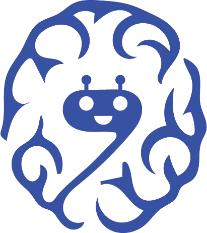

<p align="center">
  
</p>

# RAISC

**A mental wellness companion, built in public.**

We are a small team in Islamabad building [RAISC](https://raisc.org) — a place to talk, get support, and connect with licensed psychologists and psychiatrists. Alongside human care, people can check in with **Lune**, our 24/7 AI companion.

This repository is the frontend. We are opening it as we work so anyone who cares about mental health, product, or the stack can follow along.

**Website:** [raisc.org](https://raisc.org)  
**Hello:** [info@raisc.org](mailto:info@raisc.org)

> RAISC is not a crisis service and is not a substitute for emergency care or a medical diagnosis. If you or someone you know is in immediate danger, contact local emergency services.

---

## What we are building

Mental healthcare is hard to reach. We are building a calmer, more accessible path — for the person seeking help, and for the clinician or clinic trying to deliver it.

**For people seeking care**
- A private space to start the journey
- Lune, an AI companion for check-ins (chat and voice)
- Connection with licensed psychologists and psychiatrists
- Dashboards that change as someone is new, returning, or already in care

**For clinicians**
- Patient requests, sessions, and calendars
- Notes, summaries, and rescheduling
- Insights from Lune conversations to support (not replace) clinical judgment

**For clinics and organizations**
- Team and roster management
- Role-based access
- Organization dashboards and analytics

The public site and waitlist are live. The product itself is still being shaped in the open — expect rough edges, and expect it to move.

---

## This repository

This is a [Next.js](https://nextjs.org) app. It talks to a Django API (accounts, sessions, clinicians, organizations) and a FastAPI service (Lune). Voice uses [LiveKit](https://livekit.io). Those backends live in other repositories.

| Branch | What you are looking at |
| --- | --- |
| [`main`](https://github.com/hammad-ahmed-01/raisc_frontend/tree/main) | The public website deployed at [raisc.org](https://raisc.org) |
| [`demo`](https://github.com/hammad-ahmed-01/raisc_frontend/tree/demo) | **Latest product code** — dashboards, Lune, clinician and organization tools |

GitHub’s default branch is `main`, so that is the marketing site. To run or read the product, check out `demo`.

Other branches are how we work internally. They are not a stable public surface.

---

## Stack

- Next.js 15 (App Router) and React 19
- TypeScript
- Tailwind CSS
- LiveKit for voice with Lune
- Django API and FastAPI chatbot (separate services)

---

## Run it locally

You will need **Node.js 18.18+** and the backend services (or someone on the team to share a running environment). For the product, use `demo`:

```bash
git clone https://github.com/hammad-ahmed-01/raisc_frontend.git
cd raisc_frontend
git checkout demo
npm install
```

Create a `.env.local` in the project root (never commit it). A minimal setup looks like:

```env
NEXT_PUBLIC_DJANGO_BASE_URL=http://127.0.0.1:8000
NEXT_PUBLIC_FASTAPI_BASE_URL=http://127.0.0.1:8080
NEXT_PUBLIC_BACKEND_CONNECTED=true
```

Then:

```bash
npm run dev
```

Open [http://localhost:3000](http://localhost:3000).

To look at the public site the way [raisc.org](https://raisc.org) is shipped, check out `main` instead of `demo`.

### Environment variables

| Variable | Used for |
| --- | --- |
| `NEXT_PUBLIC_DJANGO_BASE_URL` | Django API |
| `NEXT_PUBLIC_FASTAPI_BASE_URL` | Lune / chatbot API |
| `NEXT_PUBLIC_BACKEND_CONNECTED` | Feature flag for live backend calls |
| `LIVEKIT_URL`, `LIVEKIT_API_KEY`, `LIVEKIT_API_SECRET`, `NEXT_PUBLIC_LIVEKIT_URL` | Voice with Lune |
| `ZOHO_CLIENT_ID`, `ZOHO_CLIENT_SECRET`, `ZOHO_REFRESH_TOKEN`, `ZOHO_ACCOUNT_ID`, `ZOHO_DC` | Transactional email (contact, registration) |
| `EMAIL_FROM`, `CONTACT_RECIPIENT_EMAIL` | Outbound mail |

If a variable is missing, the related feature simply will not work — the rest of the app can still run.

---

## Follow along

We are a small mix of engineers, designers, and people who care about mental health. Building in public means you can see the work, ask questions, and tell us what would actually help.

- Use the product site: [raisc.org](https://raisc.org)
- Open a GitHub issue for a bug or an idea
- Email [info@raisc.org](mailto:info@raisc.org) if you want to collaborate, volunteer clinical perspective, or just say hello

Please do **not** open pull requests with secrets, production credentials, or anyone’s real health data. If you are unsure whether something belongs in git, it does not.

This source is shared so people can learn with us. It is not an invitation to reuse RAISC as your own product. If you want to work together, write to us first.

---

## Scripts

```bash
npm run dev    # local development (Turbopack)
npm run build  # production build
npm run start  # serve the production build
npm run lint   # ESLint
```
